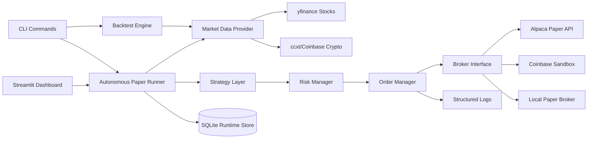

# Architecture

## Key Design Decisions

- Broker adapters implement one `BaseBroker` contract, so execution code does not depend on a specific platform.
- Live trading is blocked by default and requires environment, config, broker, and confirmation guardrails.
- Broker-hosted paper trading is separate from local simulation.
- The autonomous runner writes every decision to SQLite for auditability.
- The dashboard is an operator console, not a trading bypass; orders still flow through `RiskManager` and `OrderManager`.

## Runtime Modes

- `backtest`: historical simulation with metrics and export files.
- `quote`: current public market data check.
- `account`: authenticated broker account check with no orders.
- `paper`: paper trading through either local simulation or a broker paper API.
- `live`: guarded path only; disabled unless explicitly configured.

